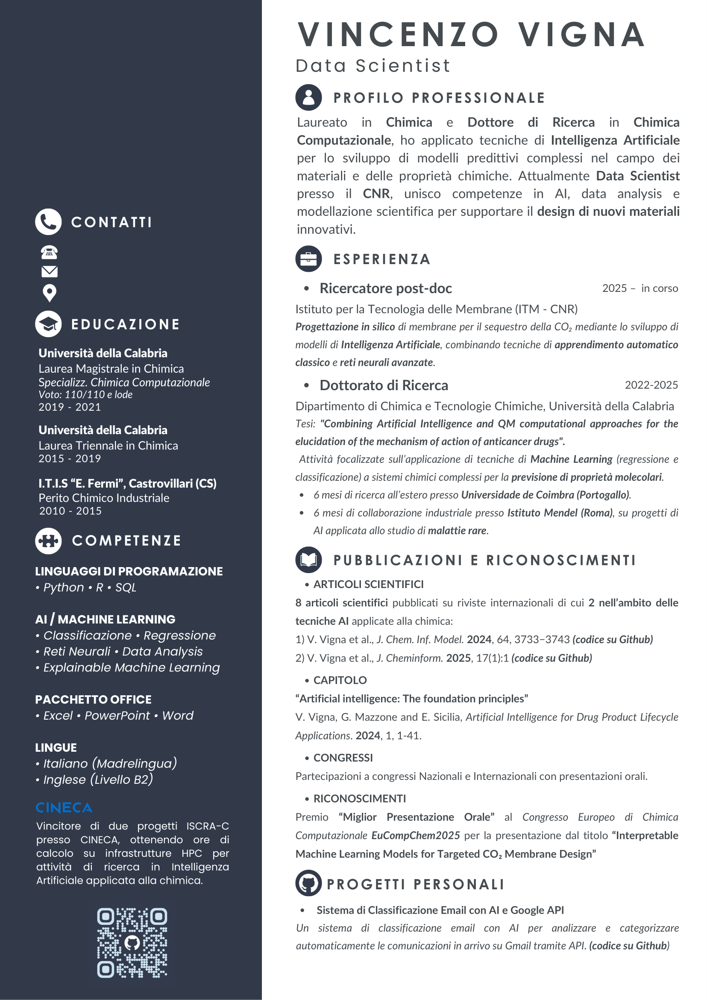

# Curriculum Vitae
# 👋 Vincenzo Vigna — Data Scientist

---

🎯 **About Me**  
Data Scientist con background in Chimica Computazionale e Intelligenza Artificiale.  
Attualmente ricercatore presso il CNR, sviluppo modelli predittivi interpretabili per la progettazione di materiali innovativi.  

🔬 **Aree di interesse**  
- Machine Learning e Explainable AI  
- Data Analysis e Modellazione predittiva  
- High Performance Computing (HPC)  
- AI applicata alla chimica e ai materiali  

📚 **Pubblicazioni selezionate**  
1. V. Vigna *et al.*, *J. Chem. Inf. Model.* 2024, 64, 3733−3743  
2. V. Vigna *et al.*, *J. Cheminform.* 2025, 17(1):1  

---

📄 **Download CV (PDF)**  
[CV_Vincenzo_Vigna.pdf](CV_Vincenzo_Vigna.pdf)

---

📫 **Contatti**
- [LinkedIn](https://www.linkedin.com/in/tuo-profilo)
- [GitHub](https://github.com/vvigna)
